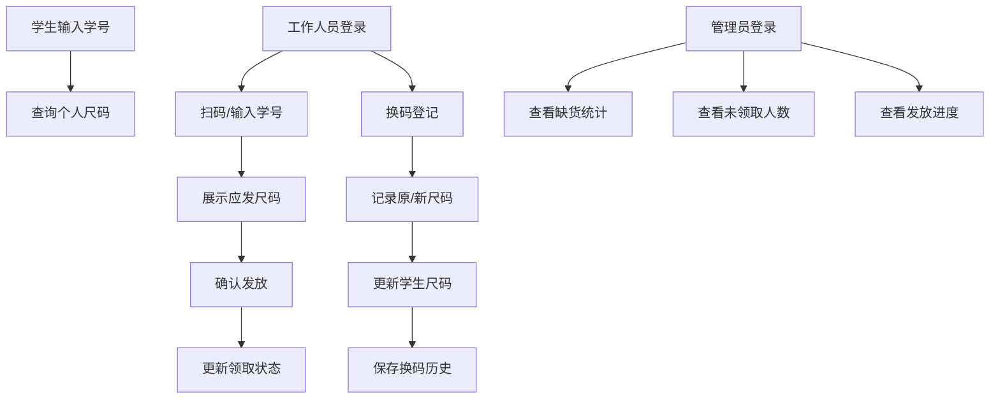

## 1. 产品概述
军训服尺码发放查询系统，用于高校军训期间服装发放管理，解决尺码查询、发放核销、换码登记和库存统计等问题。
- 主要用途：学生自助查询尺码、工作人员扫码核销发放、管理员监控发放进度和库存状态
- 目标用户：全体参训学生、发放工作人员、各学院管理员
- 产品价值：提升发放效率，减少人工错误，实时掌握发放进度

## 2. 核心功能

### 2.1 用户角色
| 角色 | 登录方式 | 核心权限 |
|------|---------|---------|
| 学生 | 学号查询（无需登录） | 查看个人领取的上衣、裤子、鞋、腰带尺码，查看领取状态 |
| 工作人员 | 账号密码登录 | 扫码/输入学号核销发放，登记换码 |
| 学院管理员 | 账号密码登录 | 查看本院缺货统计、未领取人数、发放进度报表 |

### 2.2 功能模块
1. **首页/学生查询页**：学号输入框，个人尺码信息展示
2. **工作人员登录页**：账号密码登录入口
3. **发放核销页**：扫码/手动输入学号，展示学生信息和应发尺码，一键确认发放
4. **换码登记页**：选择学生，记录原尺码和新尺码，保存换码记录
5. **管理员登录页**：学院管理员登录入口
6. **管理统计页**：缺货统计、未领取人数统计、各尺码发放进度

### 2.3 页面详情
| 页面名称 | 模块名称 | 功能描述 |
|---------|---------|---------|
| 学生查询页 | 学号输入模块 | 输入学号后展示个人尺码信息和领取状态 |
| 学生查询页 | 尺码展示模块 | 展示上衣、裤子、鞋、腰带的尺码和领取状态 |
| 发放核销页 | 扫码/输入模块 | 支持扫码枪输入或手动输入学号 |
| 发放核销页 | 发放确认模块 | 展示学生信息和应发尺码，确认后标记为已领取 |
| 换码登记页 | 换码表单模块 | 选择学生，选择换码类型（上衣/裤子/鞋/腰带），输入原尺码和新尺码 |
| 换码登记页 | 换码记录列表 | 展示历史换码记录 |
| 管理统计页 | 缺货统计模块 | 按学院、按尺码展示缺货数量 |
| 管理统计页 | 未领取统计模块 | 展示各学院未领取人数和名单 |
| 管理统计页 | 发放进度模块 | 整体发放进度百分比和各学院进度 |

## 3. 核心流程

### 学生查询流程
学生输入学号 → 系统查询尺码信息 → 展示上衣、裤子、鞋、腰带尺码和领取状态

### 发放核销流程
工作人员登录 → 扫码/输入学号 → 展示学生信息和应发尺码 → 确认发放 → 更新领取状态

### 换码流程
工作人员登录 → 选择学生 → 选择换码类型 → 输入原尺码和新尺码 → 提交 → 记录换码历史 → 更新学生尺码

### 管理员统计流程
学院管理员登录 → 查看本院缺货统计 → 查看未领取人数 → 查看发放进度

## 4. 用户界面设计

### 4.1 设计风格
- 主色调：军绿色（#4A5D23），体现军训主题
- 辅助色：深橙色（#D97706）用于操作按钮，灰色（#6B7280）用于辅助信息
- 按钮风格：圆角矩形，悬停时有轻微阴影和颜色加深效果
- 字体：使用 "Noto Sans SC" 作为主要字体，标题加粗，正文适中
- 布局风格：卡片式布局，清晰的模块分隔，信息层级分明
- 图标风格：使用 lucide-react 线性图标，与整体简约风格一致

### 4.2 页面设计概述
| 页面名称 | 模块名称 | UI元素 |
|---------|---------|--------|
| 学生查询页 | 学号输入模块 | 大输入框，查询按钮，卡片式结果展示 |
| 发放核销页 | 扫码/输入模块 | 聚焦输入框，扫码自动触发查询，快速确认按钮 |
| 换码登记页 | 换码表单模块 | 下拉选择器，尺码输入框，提交按钮，历史记录表格 |
| 管理统计页 | 数据统计模块 | 数据卡片，条形图展示，进度条，筛选器 |

### 4.3 响应式
- Desktop-first 设计，主内容区最大宽度 1200px
- 平板端：单列布局，卡片自适应宽度
- 移动端：优化输入框和按钮大小，便于触控操作

### 4.4 微交互
- 页面加载：元素淡入动画，卡片依次出现
- 按钮悬停：背景色加深 + 轻微上浮阴影
- 数据加载：骨架屏占位
- 提交成功：绿色勾选动画 + 提示消息
