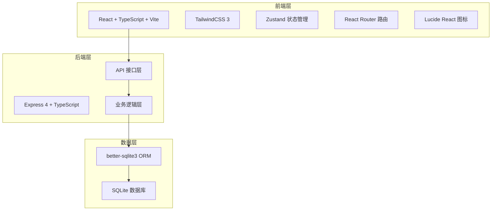
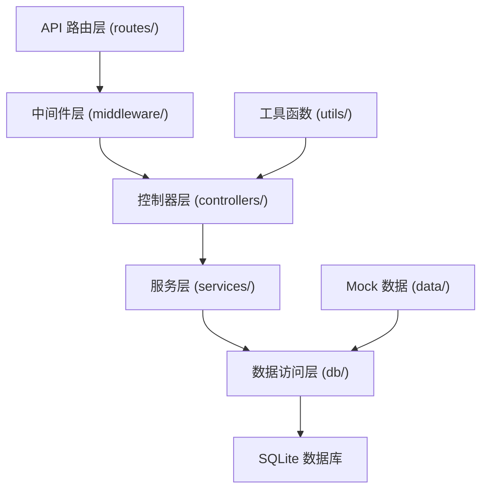
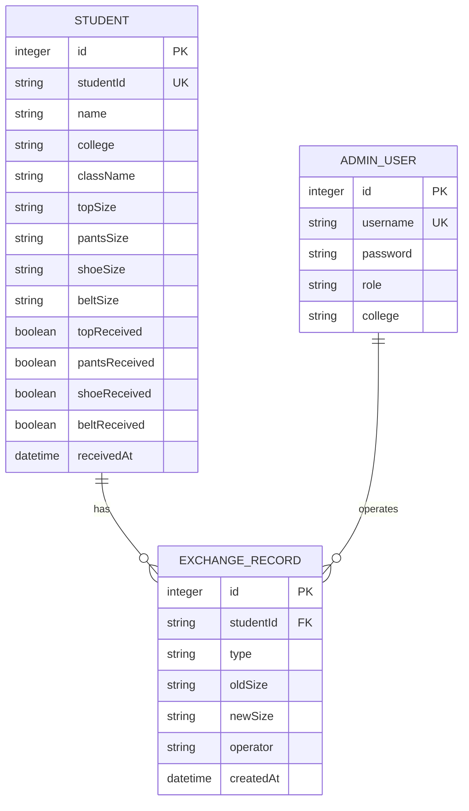

## 1. 架构设计



## 2. 技术描述
- 前端：React@18 + TypeScript + Vite + TailwindCSS@3 + Zustand + React Router Dom
- 后端：Express@4 + TypeScript
- 数据库：SQLite + better-sqlite3
- 项目初始化：vite-init react-express-ts 模板
- 图标库：lucide-react

## 3. 路由定义

| 路由路径 | 页面名称 | 说明 |
|---------|---------|------|
| / | 学生查询页 | 首页，学生输入学号查询尺码 |
| /staff/login | 工作人员登录页 | 工作人员账号密码登录 |
| /staff/distribute | 发放核销页 | 扫码/输入学号，确认发放 |
| /staff/exchange | 换码登记页 | 记录换码信息，查看历史记录 |
| /admin/login | 管理员登录页 | 学院管理员登录 |
| /admin/dashboard | 管理统计页 | 缺货、未领取、发放进度统计 |

## 4. API 定义

### 类型定义
```typescript
// 学生信息
interface Student {
  id: number;
  studentId: string;
  name: string;
  college: string;
  className: string;
  topSize: string;
  pantsSize: string;
  shoeSize: string;
  beltSize: string;
  topReceived: boolean;
  pantsReceived: boolean;
  shoeReceived: boolean;
  beltReceived: boolean;
  receivedAt?: string;
}

// 换码记录
interface ExchangeRecord {
  id: number;
  studentId: string;
  type: 'top' | 'pants' | 'shoe' | 'belt';
  oldSize: string;
  newSize: string;
  operator: string;
  createdAt: string;
}

// 管理员账户
interface AdminUser {
  id: number;
  username: string;
  role: 'staff' | 'admin';
  college?: string;
}

// 统计数据
interface StatsData {
  totalStudents: number;
  receivedStudents: number;
  notReceivedStudents: number;
  outOfStock: {
    type: string;
    size: string;
    count: number;
  }[];
  byCollege: {
    college: string;
    total: number;
    received: number;
    notReceived: number;
  }[];
}
```

### API 接口
| 方法 | 路径 | 说明 | 请求参数 | 返回值 |
|------|------|------|---------|--------|
| GET | /api/student/:studentId | 查询学生信息 | studentId (学号) | Student \| null |
| POST | /api/staff/login | 工作人员登录 | { username, password } | { success, token, user } |
| POST | /api/distribute/confirm | 确认发放 | { studentId, items: string[] } | { success } |
| POST | /api/exchange | 登记换码 | { studentId, type, oldSize, newSize, operator } | { success } |
| GET | /api/exchange/records | 获取换码记录 | studentId? (可选) | ExchangeRecord[] |
| POST | /api/admin/login | 管理员登录 | { username, password } | { success, token, user } |
| GET | /api/admin/stats | 获取统计数据 | college? (可选) | StatsData |
| GET | /api/admin/not-received | 获取未领取名单 | college? (可选) | Student[] |

## 5. 服务端架构



## 6. 数据模型

### 6.1 实体关系图



### 6.2 DDL 语句

```sql
-- 学生表
CREATE TABLE IF NOT EXISTS students (
  id INTEGER PRIMARY KEY AUTOINCREMENT,
  student_id TEXT UNIQUE NOT NULL,
  name TEXT NOT NULL,
  college TEXT NOT NULL,
  class_name TEXT NOT NULL,
  top_size TEXT NOT NULL,
  pants_size TEXT NOT NULL,
  shoe_size TEXT NOT NULL,
  belt_size TEXT NOT NULL,
  top_received INTEGER DEFAULT 0,
  pants_received INTEGER DEFAULT 0,
  shoe_received INTEGER DEFAULT 0,
  belt_received INTEGER DEFAULT 0,
  received_at TEXT
);

-- 换码记录表
CREATE TABLE IF NOT EXISTS exchange_records (
  id INTEGER PRIMARY KEY AUTOINCREMENT,
  student_id TEXT NOT NULL,
  type TEXT NOT NULL,
  old_size TEXT NOT NULL,
  new_size TEXT NOT NULL,
  operator TEXT NOT NULL,
  created_at TEXT NOT NULL DEFAULT CURRENT_TIMESTAMP,
  FOREIGN KEY (student_id) REFERENCES students(student_id)
);

-- 管理员用户表
CREATE TABLE IF NOT EXISTS admin_users (
  id INTEGER PRIMARY KEY AUTOINCREMENT,
  username TEXT UNIQUE NOT NULL,
  password TEXT NOT NULL,
  role TEXT NOT NULL,
  college TEXT
);

-- 索引
CREATE INDEX IF NOT EXISTS idx_student_id ON students(student_id);
CREATE INDEX IF NOT EXISTS idx_student_college ON students(college);
CREATE INDEX IF NOT EXISTS idx_exchange_student ON exchange_records(student_id);
```

### 6.3 初始化数据

```sql
-- 插入示例学生数据
INSERT INTO students (student_id, name, college, class_name, top_size, pants_size, shoe_size, belt_size) VALUES
('2024001', '张三', '计算机学院', '计科2401', 'L', '32', '42', 'M'),
('2024002', '李四', '计算机学院', '计科2401', 'XL', '34', '43', 'L'),
('2024003', '王五', '电子工程学院', '电子2401', 'M', '30', '41', 'M'),
('2024004', '赵六', '电子工程学院', '电子2401', 'XXL', '36', '44', 'L'),
('2024005', '孙七', '机械工程学院', '机械2401', 'L', '32', '42', 'M'),
('2024006', '周八', '机械工程学院', '机械2401', 'XL', '34', '43', 'L'),
('2024007', '吴九', '计算机学院', '计科2402', 'M', '30', '40', 'S'),
('2024008', '郑十', '计算机学院', '计科2402', 'L', '32', '42', 'M');

-- 插入管理员用户（密码使用 bcrypt 或简单明文用于演示）
INSERT INTO admin_users (username, password, role, college) VALUES
('staff1', 'staff123', 'staff', NULL),
('staff2', 'staff123', 'staff', NULL),
('admin_cs', 'admin123', 'admin', '计算机学院'),
('admin_ee', 'admin123', 'admin', '电子工程学院'),
('admin_me', 'admin123', 'admin', '机械工程学院');
```
